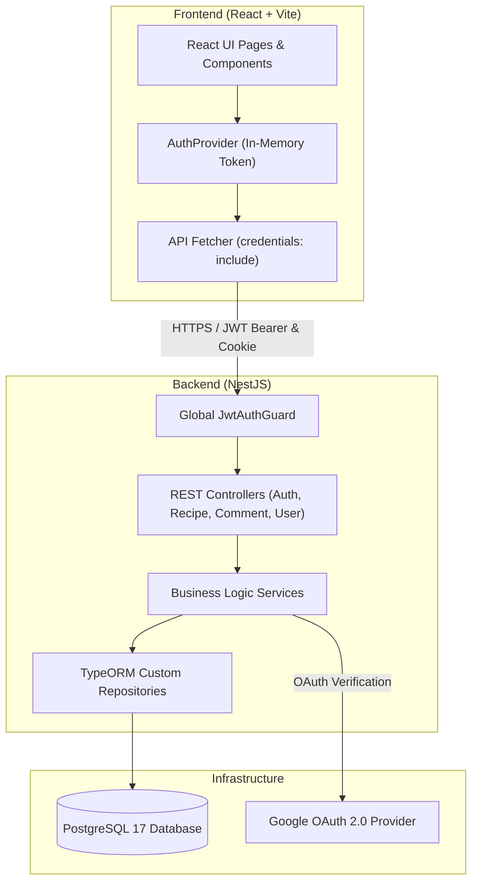
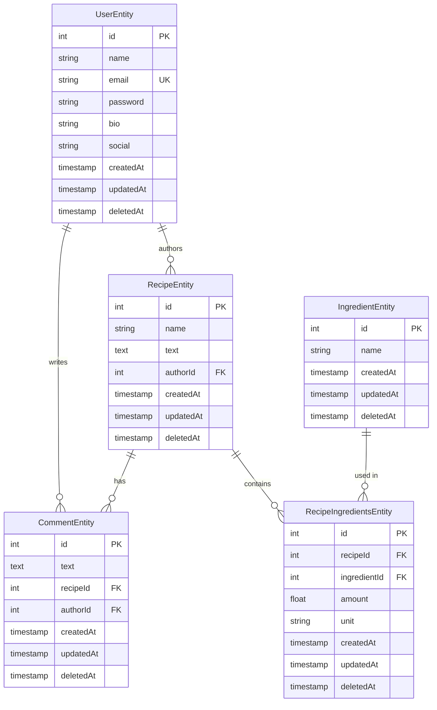

<div align="center">
  <h1>Recipe Hub</h1>
  <p>
    Сучасний веб-застосунок для обміну рецептами, побудований з використанням <strong>NestJS</strong> та <strong>React</strong> у монорепозиторії (pnpm workspace).
  </p>

  <!-- Баджі -->
  <p>
    <a href="https://github.com/Drotyk/Recipe Hub/actions/workflows/ci.yml">
  
</a>

    
    
    
    
  </p>
</div>

<br />

## Про проєкт

**Recipe Hub** - це повнофункціональний веб-додаток для публікації, пошуку та коментування кулінарних рецептів.
Проєкт побудовано як монорепозиторій за допомогою `pnpm workspace`, що поєднує строго типізований бекенд на **NestJS** (TypeORM, PostgreSQL) та сучасний фронтенд на **React** (Vite).

---

## Статус CI & Тестування

Проєкт містить автоматичний **GitHub Actions Workflow** ([`.github/workflows/ci.yml`](.github/workflows/ci.yml)), який запускається при кожному `push` та `pull_request` у гілки `main`, `master`, `develop`.

CI виконує такі етапи:
1. `pnpm install --frozen-lockfile` — встановлення залежностей з перевіркою lockfile.
2. `pnpm backend:lint` - перевірка коду ESLint на відповідність стандартам.
3. `pnpm backend:test` - запуск **43 unit-тестів** (Auth, Recipe, Comment, DTO validation).
4. `pnpm backend:build` - компіляція бекенду NestJS (`nest build`).
5. `pnpm frontend:lint` - перевірка типів TypeScript (`tsc --noEmit`).
6. `pnpm frontend:build` - збірка фронтенду (`vite build`).

---

## Функціональні можливості

- **Захищена аутентифікація**: Реєстрація та логін з хешуванням `bcrypt`, JWT access tokens у пам'яті та `HttpOnly` refresh cookies.
- **Google OAuth 2.0 Integration**: Вхід через Google з безпечним обміном короткоживучого одноразового коду.
- **Керування рецептами (CRUD)**: Створення, редагування, перегляд та soft-delete рецептів.
- **Інгредієнти та прив'язки**: Каталог інгредієнтів з прив'язкою до рецептів (`amount`, `unit`).
- **Коментарі**: Додавання та видалення коментарів до рецептів у реальному часі.
- **Рольова модель та власність**: Звичайні користувачі можуть редагувати лише власні сутності; адміністратори мають розширені права.
- **Пошук та пагінація**: Пошук рецептів, інгредієнтів та користувачів із гнучкою пагінацією.
- **Інтерактивний Swagger UI**: Повна специфікація API з авторизацією через Bearer токени.

---

## Архітектура системи



---

## ER-діаграма бази даних



---

## Безпекові рішення (Security Decisions)

Всі ключові рішення прийнято згідно з рекомендаціями OWASP:

1. **HttpOnly, Secure, SameSite=Strict Cookies for Refresh Tokens**:
   Refresh token записується у `Set-Cookie` сервером і недоступний для JavaScript (`document.cookie`), що повністю унеможливлює його викрадення через XSS-атаки.
2. **In-Memory Access Tokens**:
   Access token зберігається виключно в пам'яті React-стану (`useState`), без використання `localStorage` чи `sessionStorage`.
3. **One-Time OAuth Code Exchange**:
   Після авторизації через Google бекенд повертає не токени напряму в query-параметрах, а підписаний короткоживучий одноразовий код (`oauthCode`, TTL = 2 хвилини). Фронтенд одразу обмінює його через `POST /auth/exchange` та очищає URL через `history.replaceState()`.
4. **Private-by-Default API**:
   `JwtAuthGuard` зареєстровано глобально через `APP_GUARD` у `AppModule`. Усі ендпоінти приватні за замовчуванням. Публічні маршрути (`/auth/*`, `GET /recipe`) явно відмічені декоратором `@Public()`.
5. **Strict Ownership Enforcement**:
   Бекенд категорично не довіряє `authorId` із тіла запиту клієнта. Значення `authorId` береться виключно із перевіреного JWT (`req.user.id`). Редагування чи видалення дозволено лише автору сутності або `isAdmin: true`.
6. **Enumeration Protection**:
   Під час спроби входу при невідомому email або невірному паролі повертається однакова помилка `401 Unauthorized ("Invalid credentials")`.

---

## Швидкий старт

### 1. Запуск бази даних (Docker)

```bash
docker compose -f ./docker-compose.yml up -d
```

### 2. Конфігурація середовища (`.env`)

Скопіюйте `.env.example` у `.env` та вкажіть власні секрети:

```bash
cp .env.example .env
```

### 3. Встановлення залежностей та запуск

> [!WARNING]
> **Важливо:** Не запускайте `pnpm install` всередині окремих підпапок (наприклад, `apps/backend`). Усі залежності встановлюються виключно з кореня проєкту!

```bash
# 1. Встановлення всіх залежностей
pnpm install

# 2. Виконання міграцій БД
pnpm backend:mi:run

# 3. Запуск бекенду (NestJS)
pnpm backend:start:dev

# 4. Запуск фронтенду (React + Vite)
pnpm frontend:start
```

---

## API Endpoints & Swagger

Інтерактивна документація Swagger доступна за адресою:  
**`http://localhost:3000/api-docs`**

### Основні маршрути API:

| Модуль | Метод | Endpoint | Доступ | Опис |
|---|---|---|---|---|
| **Auth** | `POST` | `/auth/register` | Public | Реєстрація нового користувача |
| | `POST` | `/auth/login` | Public | Вхід та отримання токена + HttpOnly Cookie |
| | `POST` | `/auth/exchange` | Public | Обмін одноразового OAuth-коду на токени |
| | `POST` | `/auth/refresh` | Public | Оновлення access токена через HttpOnly Cookie |
| | `GET` | `/auth/google` | Public | Перенаправлення на Google OAuth |
| | `GET` | `/auth/google/callback` | Public | Callback Google OAuth |
| **Recipe** | `GET` | `/recipe/collection` | Public | Отримання списку рецептів (з пагінацією та пошуком) |
| | `GET` | `/recipe/:id` | Public | Отримання деталей рецепта за ID |
| | `POST` | `/recipe` | Private | Створення рецепта (authorId = req.user) |
| | `PATCH` | `/recipe/:id` | Owner / Admin | Оновлення рецепта |
| | `DELETE` | `/recipe/:id` | Owner / Admin | Видалення рецепта (soft-delete) |
| **Comment** | `GET` | `/recipe/:recipeId/comments` | Public | Отримання коментарів до рецепта |
| | `POST` | `/recipe/:recipeId/comments` | Private | Створення коментаря |
| | `DELETE` | `/comment/:id` | Owner / Admin | Видалення коментаря |
| **Ingredient** | `GET` | `/ingredient/collection` | Public | Список інгредієнтів |
| | `POST` | `/ingredient` | Private | Додавання інгредієнта |
| **User** | `GET` | `/user/collection` | Public | Список користувачів |
| | `GET` | `/user/:id` | Public | Профіль користувача |

---

## Міграції бази даних

Усі міграції керуються через TypeORM CLI за допомогою згорткових скриптів з кореня монорепозиторію:

```bash
# Перегляд статусу та списку виконаних міграцій
pnpm backend:mi:show

# Виконання всіх не застосованих міграцій
pnpm backend:mi:run

# Відкат останньої виконаної міграції
pnpm backend:mi:revert

# Створення нової порожньої міграції
pnpm backend:mi:c AddUserAvatar
```

---

## Структура проєкту

```text
.
├── .github/
│   └── workflows/
│       └── ci.yml               # GitHub Actions CI workflow
├── apps/
│   ├── backend/                 # NestJS backend
│   │   ├── src/
│   │   │   ├── business-logic/  # Сервіси бізнес-логіки та unit-тести (*.spec.ts)
│   │   │   │   └── auth/        # Auth service, JWT strategy, tests
│   │   │   ├── common/          # Guards, decorators, utils, interfaces
│   │   │   ├── controllers/     # REST controllers (Swagger annotated)
│   │   │   ├── domains/
│   │   │   │   ├── entities/    # TypeORM Entities
│   │   │   │   └── view-models/ # DTOs та їх тести
│   │   │   ├── modules/         # NestJS модулі (DbModule, etc.)
│   │   │   ├── repositories/    # TypeORM кастомні репозиторії
│   │   │   ├── app.module.ts    # Глобальний реєстратор Guards
│   │   │   └── main.ts          # Вхідна точка (CORS, CookieParser, Swagger)
│   │   ├── type-orm/            # Міграції бази даних
│   │   └── tsconfig.json        # Strict TypeScript конфігурація
│   └── frontend/                # React + Vite frontend
│       ├── src/
│       │   ├── api.ts           # Interceptor з in-memory токеном та credentials: include
│       │   ├── auth.tsx         # AuthProvider з OAuth code exchange
│       │   ├── pages/           # Сторінки додатку
│       │   └── styles.css
│       └── index.html
├── docker-compose.yml           # PostgreSQL 17 & pgAdmin
├── package.json                 # Скрипти монорепозиторію
└── pnpm-workspace.yaml          # Конфігурація pnpm workspace
```

---

## Roadmap (План розвитку)

- [x] Глобальна JWT авторизація (`APP_GUARD`)
- [x] Авторизація через Google OAuth 2.0 (з одноразовим кодом обміну)
- [x] Захист Refresh Token через `HttpOnly` Cookies
- [x] 100% покриття перевірок власності (Ownership Check) для рецептів та коментарів
- [x] Впровадження Strict TypeScript режиму
- [x] Покриття бізнес-логіки Unit-тестами (43+ тести)
- [x] Налаштування CI у GitHub Actions
- [ ] Впровадження підтвердження Email при реєстрації (Email Verification)
- [ ] Додавання рольової системи (RBAC) з декоратором `@Roles()`
- [ ] Автоматичне оновлення токена на клієнті при 401 (Silent Refresh Interceptor)
- [ ] Покриття E2E тестами (Playwright / Supertest)
